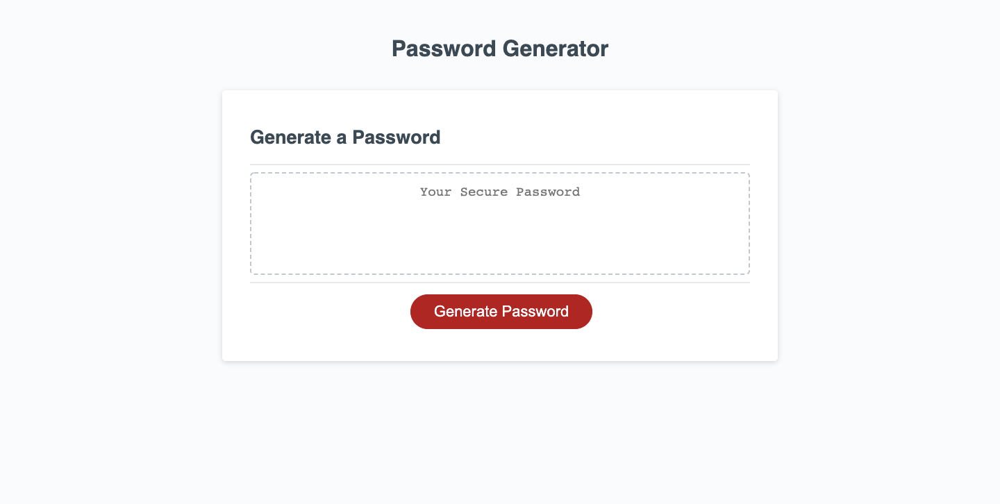
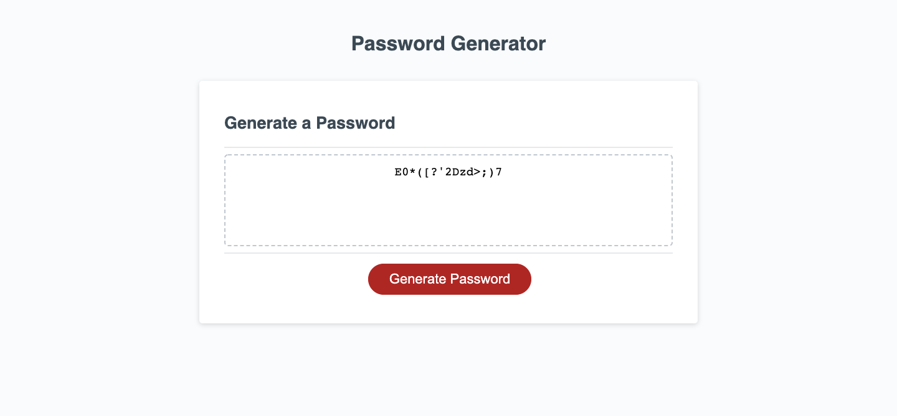

# Random password generator

## Description
This is a web application that creates a strong password that provides greater security. When a user click the button, they will choose the length of the password which has to be at least 8 characters and no more than 128 characters. After the answer being validated, they will be presented with a series of prompts for password criteria that includes lowercase, uppercase, numeric, and/or special characters. At least one character type should be selected. When all prompts answered, a new password is generated and written to the page.

## Built With
* HTML
* CSS
* JavaScript

## Website
https://siyanguo.github.io/password-generator/

## Contribution
< > with ❤️ by Serena Guo

